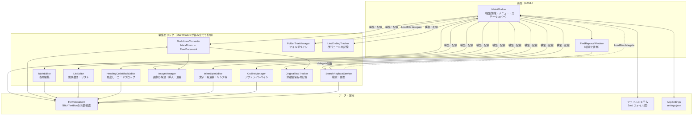
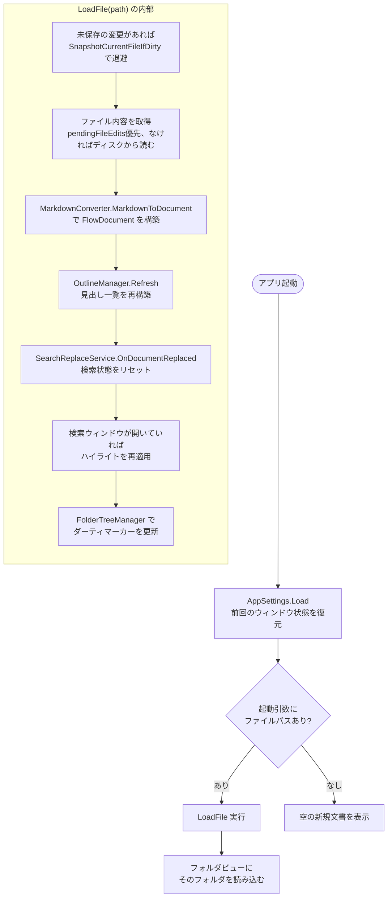
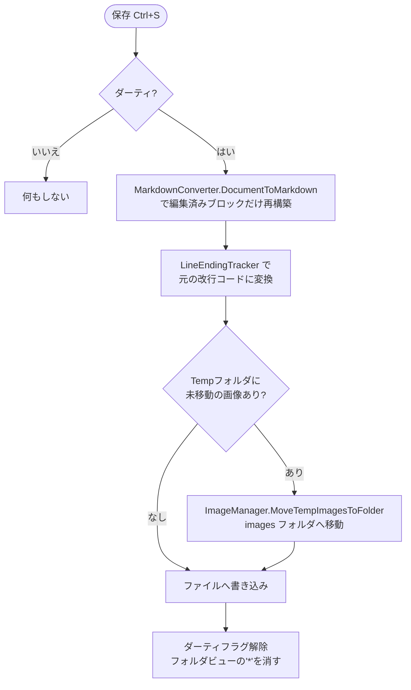
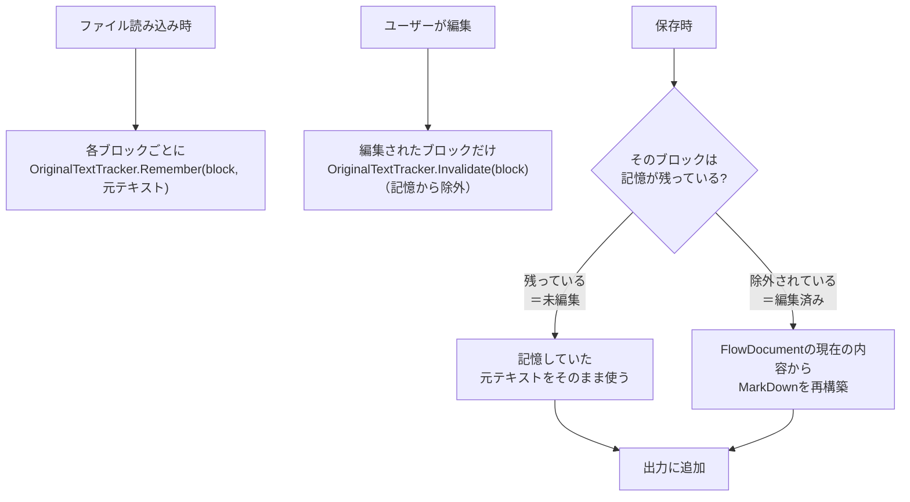
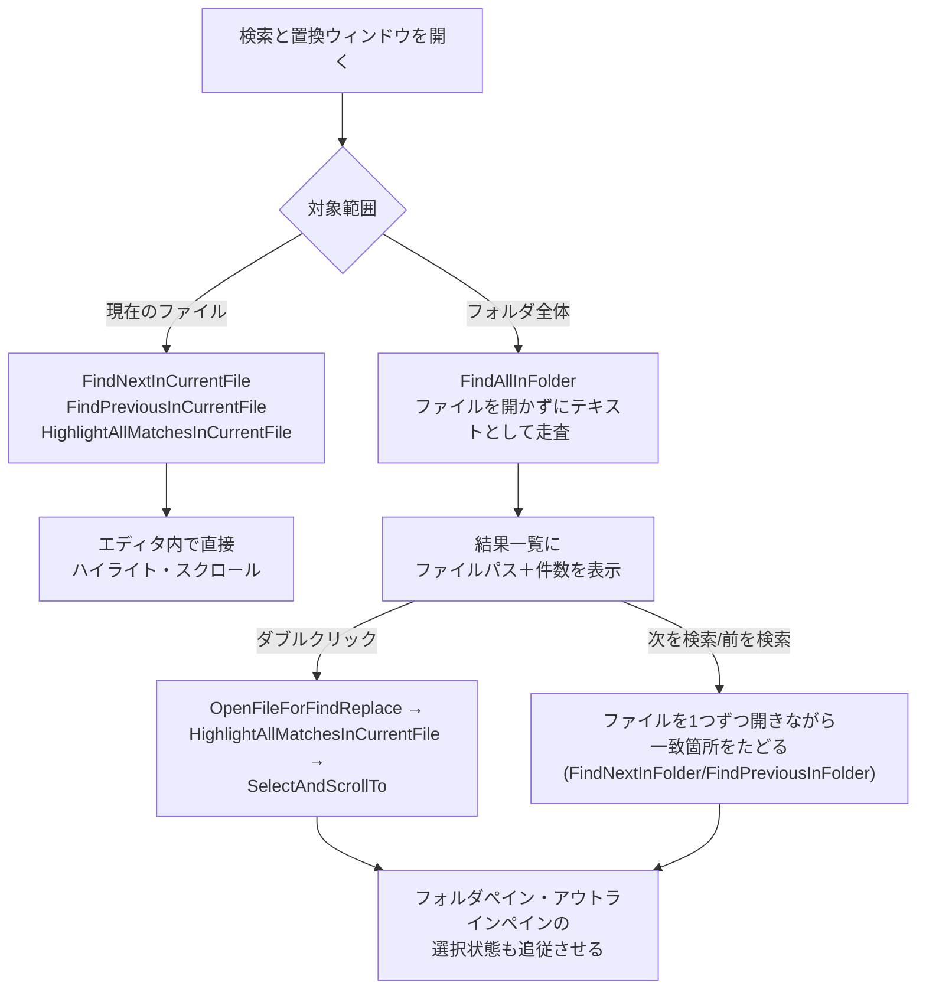
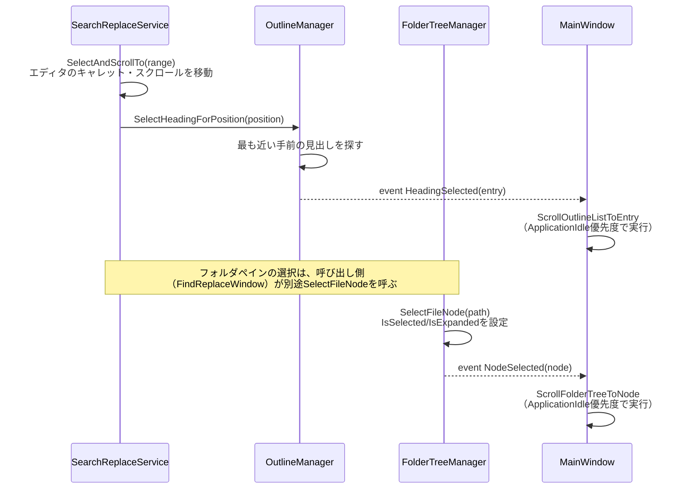
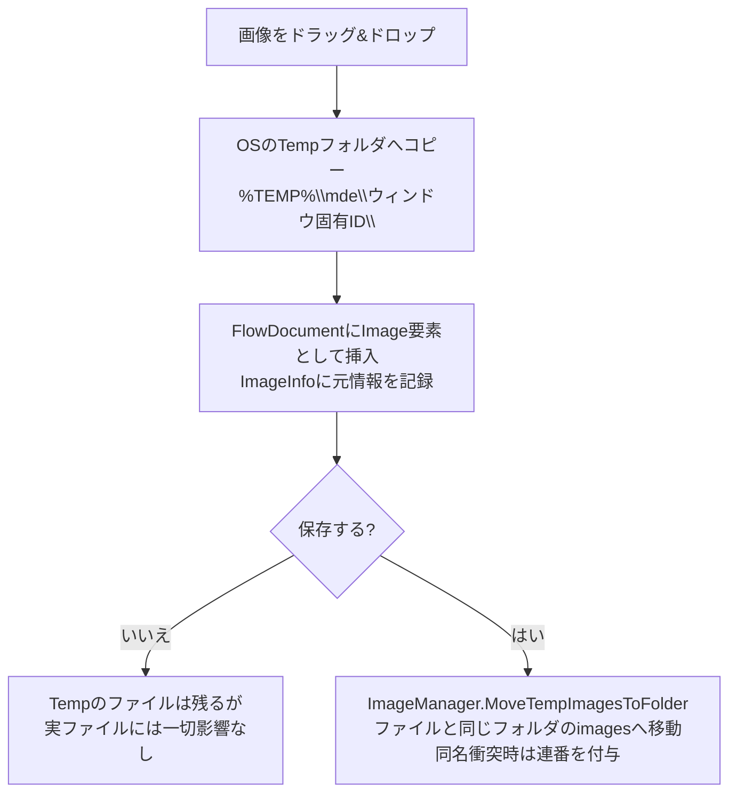

# mde 設計資料

このドキュメントは、mde（MarkDown インラインエディタ）の内部構造をまとめた開発者向け資料です。
新しい機能を追加する時、既存の挙動を変更する時に、どのクラスが何を担当しているか、
どういう仕組みで動いているかを把握するために使ってください。

エンドユーザー向けの使い方は [`README.md`](README.md) を参照してください。

## 目次

1. [概要](#1-概要)
2. [全体アーキテクチャ](#2-全体アーキテクチャ)
3. [クラス図](#3-クラス図)
4. [各クラスの責務](#4-各クラスの責務)
5. [データモデル](#5-データモデル)
6. [主要な処理フロー](#6-主要な処理フロー)
7. [ブロック単位の非破壊保存の仕組み](#7-ブロック単位の非破壊保存の仕組み)
8. [検索・置換の仕組み](#8-検索置換の仕組み)
9. [フォルダビュー・アウトラインビューの選択追従の仕組み](#9-フォルダビューアウトラインビューの選択追従の仕組み)
10. [画像の扱い](#10-画像の扱い)
11. [設定の保存](#11-設定の保存)
12. [コーディング規約](#12-コーディング規約)
13. [ビルド・配布](#13-ビルド配布)
14. [実装上の注意点・落とし穴](#14-実装上の注意点落とし穴)
15. [既知の制約](#15-既知の制約)
16. [新しい機能を追加する時の指針](#16-新しい機能を追加する時の指針)

---

## 1. 概要

mde は、MarkDown ファイルを WYSIWYG に近い形（プレビューと同じ見た目のまま）で直接編集できる
Windows デスクトップアプリです。編集用ペインとプレビュー用ペインを分離せず、`RichTextBox` の
`FlowDocument` を直接編集対象にすることで、「入力したそばから書式が反映される」体験を実現しています。

- **プラットフォーム**: .NET 8 / WPF（`net8.0-windows`）
- **配布形態**: 自己完結型の単独 `.exe`（ランタイム別途インストール不要）
- **対応フォーマット**: MarkDown（`.md`）。表・画像・リンク・コードブロックを含む

## 2. 全体アーキテクチャ

mde は「MainWindow が全ての機能クラスを組み立てて delegate で配線する」構成です。各機能クラスは
基本的に他の機能クラスを直接参照せず、コンストラクタで渡された delegate 経由でのみ協調します。
これにより、各クラスは単体でテスト・理解しやすい単位に保たれています。



**設計方針として一貫していること**

- `TableEditor` / `ListEditor` / `HeadingCodeBlockEditor` / `InlineStyleEditor` / `ImageManager` /
  `SearchReplaceService` / `FolderTreeManager` は、いずれも `MainWindow` 本体への参照を持たず、
  必要な操作（ファイルを開く、ダーティ状態にする、等）はコンストラクタで渡された
  `Action` / `Func` delegate 経由で行います。これにより、`MainWindow.xaml.cs` を読まなくても
  各クラス単体の入出力（コンストラクタの引数）を見るだけで依存関係が分かります。
- `MarkdownConverter` は状態を持たず、`OriginalTextTracker` と `ImageManager` を協力オブジェクトと
  して受け取って変換を行います。
- `FindReplaceWindow` は別ウィンドウですが、実際の検索・置換処理は一切持たず、すべて
  `m_owner.SearchReplace`（`SearchReplaceService`）に委譲します。ウィンドウ自身は UI の状態と、
  フォルダ横断セッションでの「今どのファイル・どの一致箇所にいるか」だけを管理します。

## 3. クラス図

```mermaid
classDiagram
    class MainWindow {
        -RichTextBox m_editor
        -TextBox m_sourceEditor
        -string m_currentFilePath
        -bool m_currentFileIsDirtyFlg
        -Dictionary~string,string~ m_pendingFileEdits
        +LoadFile(path)
        +MarkDirty()
        +RunAsProgrammaticChange(action)
    }

    class MarkdownConverter {
        +MarkdownToDocument(markdown, document)
        +DocumentToMarkdown(document) string
        +BlockToMarkdown(block) string
    }

    class TableEditor {
        +InsertTable(rows, cols)
        +InsertRow(above)
        +InsertColumn(left)
        +DeleteRow()
        +DeleteColumn()
        +HandleArrowKey(direction) bool
        +CopySelectedCells()
        +PasteFromClipboard()
    }

    class ListEditor {
        +ConvertToList(paragraph, ordered)
        +HandleEnterKey() bool
        +HandleTabKey(shift) bool
    }

    class HeadingCodeBlockEditor {
        +ConvertToHeading(paragraph, level)
        +ConvertToCodeBlock(paragraph, language)
        +HandleEnterKey() bool
    }

    class InlineStyleEditor {
        +ApplyStyle(style)
        +ApplyLink(url)
        +RemoveLink()
        +HandleRealtimeConversion()
    }

    class ImageManager {
        +ResolveImagePath(src) string
        +InsertImageAtCaret(filePath)
        +MoveTempImagesToFolder(targetDir)
        +FindAllImages(document) IEnumerable
    }

    class SearchReplaceService {
        -Action~TextPointer~ m_selectOutlineHeading
        +FindNextInCurrentFile(term, cs, regex) bool
        +FindPreviousInCurrentFile(term, cs, regex) bool
        +HighlightAllMatchesInCurrentFile(term, cs, regex) List
        +SelectAndScrollTo(range)
        +FindAllInFolder(term, cs, regex) List
        +ReplaceAllInFolder(term, repl, cs, regex) List
        +OnDocumentReplaced()
    }

    class OutlineManager {
        +ObservableCollection~OutlineEntry~ Items
        +event Action~OutlineEntry~ HeadingSelected
        +Refresh()
        +SelectHeadingForPosition(position)
        +MarkSearchMatches(ranges)
        +ScrollParagraphToTop(paragraph, editor)$
    }

    class FolderTreeManager {
        +ObservableCollection~FileSystemItem~ Roots
        +string LoadedFolderRootPath
        +event Action~FileSystemItem~ NodeSelected
        +LoadFolderTree(path)
        +SelectFileNode(filePath)
        +HandleSelectedItemChanged(sender, args)
        +RefreshDirtyMarkers()
        +MarkSearchMatches(paths)
    }

    class OriginalTextTracker {
        +Remember(block, originalText)
        +TryGetOriginal(block) string
        +Invalidate(block)
    }

    class LineEndingTracker {
        +DetectAndRemember(path, content)
        +GetFor(path) string
        +Apply(text, lineEnding) string
    }

    class FindReplaceWindow {
        -MainWindow m_owner
        +ReapplyHighlightForCurrentFile()
    }

    class AppSettings {
        +double WindowWidth
        +double WindowHeight
        +bool FolderPaneVisible
        +double ZoomLevel
        +Load()$ AppSettings
        +Save()
    }

    class OutlineEntry {
        +string Text
        +int Level
        +Paragraph Target
        +bool IsSearchMatch
    }

    class FileSystemItem {
        +string Name
        +string FullPath
        +bool IsDirectory
        +bool IsSelected
        +bool IsExpanded
        +bool IsDirty
        +ObservableCollection~FileSystemItem~ Children
    }

    MainWindow "1" *-- "1" MarkdownConverter
    MainWindow "1" *-- "1" TableEditor
    MainWindow "1" *-- "1" ListEditor
    MainWindow "1" *-- "1" HeadingCodeBlockEditor
    MainWindow "1" *-- "1" InlineStyleEditor
    MainWindow "1" *-- "1" ImageManager
    MainWindow "1" *-- "1" SearchReplaceService
    MainWindow "1" *-- "1" OutlineManager
    MainWindow "1" *-- "1" FolderTreeManager
    MainWindow "1" *-- "1" OriginalTextTracker
    MainWindow "1" *-- "1" LineEndingTracker
    MainWindow "1" --> "0..1" FindReplaceWindow : 開く
    MarkdownConverter --> OriginalTextTracker : 利用
    MarkdownConverter --> ImageManager : 利用
    OutlineManager "1" o-- "*" OutlineEntry
    FolderTreeManager "1" o-- "*" FileSystemItem
    FindReplaceWindow --> SearchReplaceService : 委譲
    MainWindow --> AppSettings : 読み書き
```



## 4. 各クラスの責務

| クラス | ファイル | 責務 |
|---|---|---|
| `MainWindow` | `MainWindow.xaml(.cs)` | メインウィンドウ。全機能クラスの構築・配線、現在のファイル状態、キー入力の振り分け |
| `MarkdownConverter` | `MarkdownConverter.cs` | MarkDown テキスト ⇔ `FlowDocument` の相互変換 |
| `BlockStyles` | `BlockStyles.cs` | 見出し・コードブロックの見た目を適用する静的ヘルパー（状態を持たない） |
| `TableEditor` | `TableEditor.cs` | 表の行・列操作、セル間移動、Excel 連携（TSV/HTML クリップボード） |
| `ListEditor` | `ListEditor.cs` | 箇条書き・順序付きリストの変換、Enter/Tab の挙動 |
| `HeadingCodeBlockEditor` | `HeadingCodeBlockEditor.cs` | 見出し・コードブロックへの変換、Enter/Tab の挙動 |
| `InlineStyleEditor` | `InlineStyleEditor.cs` | 太字・取消線・インラインコード・リンクの装飾、リアルタイム変換 |
| `ImageManager` | `ImageManager.cs` | 画像パスの解決、ドラッグ&ドロップ挿入、一時フォルダ管理 |
| `SearchReplaceService` | `SearchReplaceService.cs` | 現在ファイル／フォルダ全体の検索・置換のすべてのロジック |
| `OutlineManager` | `OutlineManager.cs` | アウトラインペインの見出し収集・選択・スクロール |
| `FolderTreeManager` | `FolderTreeManager.cs` | フォルダペインのツリー構築・選択・未保存マーカー |
| `OriginalTextTracker` | `OriginalTextTracker.cs` | ブロック単位の非破壊保存のための「元テキスト」記憶 |
| `LineEndingTracker` | `LineEndingTracker.cs` | ファイルごとの改行コード（CRLF/LF）の検出・記憶 |
| `FindReplaceWindow` | `FindReplaceWindow.xaml(.cs)` | 検索と置換ウィンドウの UI 状態管理（処理自体は`SearchReplaceService`に委譲） |
| `AppSettings` | `AppSettings.cs` | ウィンドウ状態・ペイン幅・表示倍率の保存・復元（`settings.json`） |
| `Models.cs` の各クラス | `Models.cs` | `ImageInfo` / `AnchorInfo` / `CodeBlockInfo` / `LinkInfo` / `OutlineEntry` / `FileSystemItem` といった、状態を持つ小さなデータクラス群 |
| その他ダイアログ | `*Dialog.xaml(.cs)`, `AboutWindow.*` | 表サイズ指定、リンク入力、バージョン情報などの単純なモーダルダイアログ |

## 5. データモデル

編集内容は WPF の `FlowDocument`（`RichTextBox.Document`）としてメモリ上に保持されます。MarkDown
特有の情報は、標準の `FlowDocument` 要素の `Tag` プロパティにメタデータを載せる形で表現しています。

| 要素 | `Tag` の内容 | 用途 |
|---|---|---|
| `Paragraph`（見出し） | `int`（1〜6） | 見出しレベル |
| `Paragraph`（コードブロック） | `CodeBlockInfo` | 言語名 |
| `Paragraph`（本文） | `null` | 通常の段落 |
| `Run`（装飾） | `"bold"` / `"strikethrough"` / `"inline-code"` / `"escaped"` | インライン書式 |
| `Run`（リンク） | `LinkInfo` | リンク先URL、自動リンクかどうか |
| `Run`（アンカー） | `AnchorInfo` | `<a id="...">` の目印 |
| `Image` | `ImageInfo` | 元のsrc、alt、元の記法（html/md） |

`FileSystemItem` と `OutlineEntry`（`Models.cs`）は `INotifyPropertyChanged` を実装しており、
フォルダペイン・アウトラインペインの表示（未保存マーカー、検索ヒットの強調表示、選択状態）を
データバインディングでライブに更新します。

## 6. 主要な処理フロー

### 6.1 起動〜ファイルを開く



### 6.2 保存



### 6.3 MarkDown → FlowDocument 変換の概略


逆方向（`DocumentToMarkdown`）では、`OriginalTextTracker` に記憶されている「未編集」ブロックは
元テキストをそのまま使い、編集されたブロックだけを `FlowDocument` の現在の内容から MarkDown へ
再構築します（詳細は[7章](#7-ブロック単位の非破壊保存の仕組み)）。

## 7. ブロック単位の非破壊保存の仕組み

見出し・段落・箇条書き・表・コードブロックといった **ブロック単位** で、「読み込んだ時の元テキスト」を
`OriginalTextTracker` が記憶します。保存時、そのブロックが編集されていなければ記憶した元テキストを
そのまま書き出し、編集されていれば `FlowDocument` の現在の内容から MarkDown を再構築します。



**この仕組みが必要な理由**：MarkDown には同じ見た目を表現する書き方が複数存在します
（例：箇条書きの `*` と `-`、番号付きリストの連番か `1.` の繰り返しか、表のセル内の余白の
入れ方など）。単純に「見た目から毎回 MarkDown を機械的に生成する」実装にすると、触っていない
箇所の書き方までもが保存のたびに変わってしまい、Git 等での差分が意味のない場所にまで及んで
しまいます。ブロック単位で「変更したところだけ書き直す」ことで、この問題を避けています。

**トレードオフ**: ブロックとブロックの間の空行の数（段落の区切り方）は、編集の有無にかかわらず
1行の空行に統一されます。また、フォルダ全体を対象にした置換や「すべて置換」（現在のファイル
対象）は、ファイル全体を一度再構築する実装のため、そのタイミングで全ブロックが「編集済み」
扱いになります。

## 8. 検索・置換の仕組み

`SearchReplaceService` が唯一の検索・置換ロジックの実装です。`FindReplaceWindow` は状態管理と
UI 表示のみを担当し、実際の検索・置換はすべてこのクラスに委譲します。



**フォルダ全体の置換は保存されるまでファイルに書き出されない**：`SearchReplaceService` は
`pendingFileEdits`（`MainWindow` が保持する `Dictionary<string, string>`）にメモリ上でのみ
変更を保持します。「すべて保存」で、現在開いているファイルと保留中の変更があるすべての
ファイルをまとめて書き出します。

**検索と置換ウィンドウを開いたままファイルを切り替えた場合**：フォルダペインでファイルを
クリックすると `LoadFile` が呼ばれ、`OnDocumentReplaced()` で検索状態がリセットされます。この直後、
検索ウィンドウが開いていれば `FindReplaceWindow.ReapplyHighlightForCurrentFile()` を呼び、
現在の検索条件で新しく開いたファイルの一致箇所を再度ハイライトします。

## 9. フォルダビュー・アウトラインビューの選択追従の仕組み

検索結果へジャンプした時など、エディタ内の特定の位置へ移動したのに合わせて、フォルダビュー・
アウトラインビューの選択状態も追従させる仕組みです。



`ApplicationIdle` 優先度を使っている理由や、ここで過去に起きた不具合については
[14.3 節](#143-フォルダペインの選択とエディタの操作を同時に行うと干渉する)を参照してください。

## 10. 画像の扱い



ウィンドウを閉じるときに、そのウィンドウ専用の Temp サブフォルダは自動的に削除されます
（保存済みで既に移動済みのファイルは対象外）。複数ウィンドウを同時に開いていても、
ウィンドウごとに Temp のサブフォルダが分かれるため、無関係な画像ファイル名同士が衝突する
ことはありません。

## 11. 設定の保存

`AppSettings` が `%AppData%\mde\settings.json` に、ウィンドウのサイズ・位置・最大化有無・
フォルダ/アウトラインペインの表示有無と幅・表示倍率を JSON 形式で保存します。起動時に
`AppSettings.Load()` で読み込み、ウィンドウを閉じる時に保存します。読み込みに失敗した場合
（ファイルが存在しない、壊れている）は既定値を返します。

## 12. コーディング規約

このプロジェクトでは、以下の命名規則・記述スタイルを一貫して適用しています。新しいコードを
書く際もこれに従ってください。

| 対象 | 規則 | 例 |
|---|---|---|
| メンバー変数（フィールド） | `m_` プレフィックス | `m_currentFilePath` |
| メソッドの引数 | `a_` プレフィックス | `a_sender`, `a_path` |
| bool型の変数・プロパティ | `_flg` サフィックス | `m_isDirtyFlg`, `a_caseSensitiveFlg` |
| `ref`/`out`/`in` 引数 | `Rf` サフィックス | （該当箇所で使用） |
| enum 型 | `En` サフィックス | （該当箇所で使用） |
| ファイルエンコーディング | UTF-8 BOM + CRLF | 全ての `.cs` / `.xaml` |
| XMLドキュメントコメント | 日本語、簡潔に。「ベストエフォート」等の曖昧な言い回しは避ける | `/// <summary>...</summary>` |
| 判定式（`==`/`!=`） | 定数を左辺に置く（Yoda条件） | `null == x`、`0 == count` |
| `if`/`for`/`while`/`foreach` | 単文でも必ず `{}` で囲む | 省略しない |
| 1行の判定式 | 複数の比較演算子を1行に詰め込まず改行する | `&&`/`||` の前後で改行 |

これらの規約は、社内ツール `NamingFixer.Roslyn`（Roslyn を使った命名規則違反の自動検出・修正
ツール）で一括チェック・修正できます。

## 13. ビルド・配布

```
dotnet publish -c Release -r win-x64 --self-contained true -p:PublishSingleFile=true -p:IncludeNativeLibrariesForSelfExtract=true
```

`bin\Release\net8.0-windows\win-x64\publish\mde.exe` に単独実行可能ファイルが生成されます。
.NET ランタイムのインストールは不要です。

開発時は Visual Studio 2022 以降で `mde.csproj` を開いて F5、またはコマンドラインで
`dotnet run`（.NET 8 SDK と「.NET デスクトップ開発」ワークロードが必要）。

## 14. 実装上の注意点・落とし穴

このプロジェクトの開発を通じて実際に発生した不具合とその原因をまとめています。似たような
実装をする際の参考にしてください。

### 14.1 `TreeView`/`ListBox` の `IsSelected` を直接設定すると、ユーザー操作用のイベントも発火する

`FolderTreeManager.SelectFileNode()` のように、プログラム側から `FileSystemItem.IsSelected = true`
を設定すると、データバインディングされている `TreeViewItem.IsSelected` も連動して変化し、
結果として **ユーザーがクリックした時と同じ `TreeView.SelectedItemChanged` イベントが発火します**。

このイベントハンドラ（`FolderTreeManager.HandleSelectedItemChanged`）は本来「ユーザーがファイルを
クリックしたら開く」ためのものです。ここで無条件に `LoadFile()` を呼んでいると、検索結果へ
ジャンプしてフォルダペインの選択状態を更新しただけのつもりが、**同じファイルがもう一度
読み込まれ、エディタのスクロール位置やキャレット位置が先頭にリセットされてしまう**、という
不具合が実際に発生しました。

対策として、`HandleSelectedItemChanged` では「選択されたファイルが既に開いているファイルと
同じであれば、再読み込みしない」ガードを入れています。**プログラム側から選択状態だけを
変更したい場合、対応するイベントハンドラが不要な副作用（再読み込みなど）を起こさないか、
必ず確認してください。**

### 14.2 `BringIntoView()` はファイルを開いた直後だと正しい位置を認識できないことがある

`Paragraph.BringIntoView()` や `TreeViewItem.BringIntoView()` は、対象要素のレイアウトが
確定していない状態（例えば `FlowDocument` の内容を丸ごと差し替えた直後）で呼び出すと、
正しい位置へスクロールできず、文書の先頭に留まってしまうことがあります。

このプロジェクトでは最終的に、**「編集操作そのもの」と「補助的な選択状態の更新（フォルダ
ペイン・アウトラインペインへの反映）」を明確に分離し、後者を `DispatcherPriority.ApplicationIdle`
（アプリケーションが完全にアイドル状態になってから実行される、最も低い優先度）で遅延実行する」**
という方針で解決しました。`Dispatcher.BeginInvoke` の優先度を `Loaded` や `Background` に
調整するだけでは不十分だった一方、そもそも問題の本質は 14.1 節の「不要な再読み込み」だった、
という経緯があります。表示位置がおかしいと感じたら、まず「本当にタイミングの問題か、それとも
どこかで不要な処理が呼ばれていないか」を疑ってください。

### 14.3 フォルダペインの選択とエディタの操作を同時に行うと干渉する

14.1・14.2 の教訓から、フォルダペイン／アウトラインペインの「選択状態をエディタの操作に
追従させる」処理は、**エディタ自体の操作（キャレット移動・スクロール）が完全に終わった後で
実行する**設計にしています（`ApplicationIdle` 優先度）。同じタイミングで両方のレイアウト更新を
行うと、片方の `UpdateLayout()` がもう片方の保留中の `BringIntoView()` 要求に影響することが
あります。新しく似た機能を追加する際は、複数の UI 要素を同時に更新しようとせず、優先度を
分けることを検討してください。

### 14.4 `RichTextBox` へのドラッグ&ドロップは Preview 系イベントで受ける

`RichTextBox` は内部にテキスト編集用の独自ドラッグ&ドロップ処理を持っており、通常の
`DragEnter`/`DragOver`/`Drop`（バブリング）イベントだと横取りされてしまいます。
`PreviewDragEnter`/`PreviewDragOver`/`PreviewDrop`（トンネリング方式）で受け取ってください
（`ImageManager` を参照）。

### 14.5 `TextPointer.Paragraph` は入れ子構造の中では期待通りに解決しないことがある

表のセルなど、入れ子になった構造の中の位置から `.Paragraph` で段落を取得しようとすると、
期待した段落が取得できないことがあります。一致箇所を直接含む要素（`TextPointer.Parent`）を
優先して使い、`.Paragraph` はフォールバックとして使う方が確実です
（`SearchReplaceService.SelectAndScrollTo` を参照）。

### 14.6 横スクロールバーが選択変更のたびに右へずれる

`TreeView`/`ListBox` で選択項目が変わると、WPF 標準の動作でその項目を横方向にも完全に見せようと
スクロールしてしまい、項目名が長い場合に横スクロールバーが右へずれることがあります。
選択変更後、`DispatcherPriority.Loaded`（レイアウトパスが終わった直後）で横スクロールだけを
0 に戻すことで、ユーザーの手動スクロールには影響を与えずに直せます
（`MainWindow.FolderTreeSelectedItemChanged` を参照）。

### 14.7 検索結果一覧・強調表示と選択状態の背景色は競合しやすい

フォルダペイン・アウトラインペインでは「検索でヒットした」（黄色）と「選択中である」
（枠線／背景色）という2つの見た目の状態が同時に成立し得ます。同じ `Background` プロパティを
複数の `DataTrigger` で取り合うと、後から評価されたトリガーが先勝ちして片方の情報が消えて
しまいます。**選択状態は背景色ではなく枠線で表現する**ことで、検索ヒットの背景色と共存させて
います（`MainWindow.xaml` の `m_matchHighlightBorder` のトリガー定義を参照）。また、選択・
非選択で `BorderThickness` 自体を変えると行の高さが変わって表示がちらつくため、境界線の
太さは常に確保しておき、色だけを透明⇔実色で切り替えています。

### 14.8 自動化スクリプトでコード全体を書き換える時は必ず段階的に検証する

命名規則の一括変換や、判定式の左辺値定数化、`{}` の一括付与などをスクリプトで行った際、
正規表現が式の途中の意図しない位置にマッチし、構文的に壊れたコードを生成してしまったことが
複数回ありました（`?.` 演算子の直後や、`as` キャストの型名部分、メソッド呼び出しの引数部分など）。
大規模な自動変換を行う場合は、1ファイルで試してから全体に適用し、適用後は必ず全ファイルで
かっこの対応（`{`/`}`、`(`/`)`）を機械的に数えて検証してください。

## 15. 既知の制約

- ブロックとブロックの間の空行の数は、編集の有無にかかわらず1行の空行に統一されます。
- フォルダ全体を対象にした「すべて置換」・現在のファイル対象の「すべて置換」は、ファイル全体を
  一度再構築するため、そのタイミングで全ブロックが「編集済み」扱いになります。
- フォルダビューは既定で `.md` / `.markdown` ファイルのみ表示します。
- フォルダビューは `Microsoft.Win32.OpenFolderDialog`（.NET 8 で追加された API）を使用しています。
- 見出しへの変更を、箇条書き項目の中の段落に対して右クリックで行った場合、リストから完全に
  抜けずその場でスタイルだけ変わる簡易実装になっています。
- コードブロックの言語名を、作成後に変更する UI はありません（再作成が必要）。
- このコードは Windows/WPF のビルド環境上で都度コンパイル検証されているわけではないため、
  大きな変更を加えた後は必ずビルドして確認してください。

## 16. 新しい機能を追加する時の指針

1. **どのクラスの責務かを見極める**：4章の表を参照し、既存クラスに機能を追加すべきか、新しい
   クラスを起こすべきかを判断してください。「表に関することは `TableEditor`」のように、
   責務の境界を保つことで、後から読む人（次に触るあなた自身を含む）が迷わなくなります。
2. **`MainWindow` への直接参照を増やさない**：新しいクラスを作る場合も、既存のクラス群と
   同様に、必要な操作は delegate 経由で受け取る設計を踏襲してください。
3. **`OriginalTextTracker` との整合性を忘れない**：新しいブロック種別やインライン装飾を
   追加する場合、「編集していなければ元テキストのまま保存する」仕組みとどう関わるかを
   必ず検討してください。
4. **UI の同時更新は避ける**：エディタの操作と、フォルダペイン／アウトラインペインなど
   他の UI 要素の更新を同時に行う場合は、14.2〜14.3節の教訓を踏まえ、優先度やタイミングを
   意図的に分離してください。
5. **命名規則・記述スタイルを守る**：12章のコーディング規約に従ってください。
6. **大規模な自動変換は段階的に検証する**：14.8節を参照してください。
7. **このドキュメントを更新する**：新しい仕組みを追加した場合、特に「他のクラスと連携する
   処理」「タイミングに関する工夫」「はまりやすい落とし穴」は、この資料に追記しておくと
   将来の自分（またはこの会話の続きを引き継ぐ別のセッション）が助かります。
