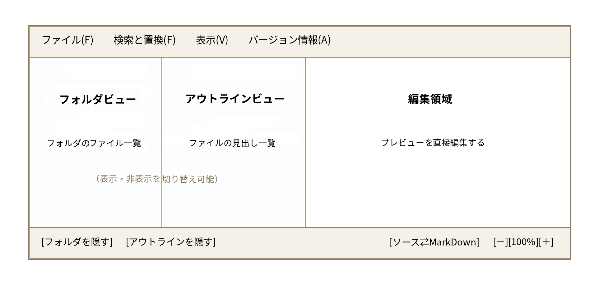

# mde（インライン編集に対応したシンプルなMarkdownエディタ）

mde は、Markdown ファイルをプレビューと同じ見た目のまま直接編集できる、Windows デスクトップ用の
Markdown エディタです。編集用とプレビュー用の画面が分かれていないので、書式が実際にどう見えるかを
確認しながらそのまま書き進められます。

このドキュメントは、mde を初めて使う方向けのガイドです。

## 目次

- [インストールと起動](#インストールと起動)
- [画面の見方](#画面の見方)
- [基本操作](#基本操作)
- [書式の書き方](#書式の書き方)
- [表（テーブル）](#表テーブル)
- [画像](#画像)
- [リンク](#リンク)
- [フォルダビュー](#フォルダビュー)
- [アウトラインビュー](#アウトラインビュー)
- [検索と置換](#検索と置換)
- [ソースモード](#ソースモード)
- [PDFへの書き出し](#pdfへの書き出し)
- [ショートカット一覧](#ショートカット一覧)
- [困ったときは](#困ったときは)

## インストールと起動

配布された `mde.msi` をダブルクリックすると、インストーラーが起動します。画面の案内に従って
進めると、インストールが完了します（すべてのユーザー向けにインストールされるため、Windowsから
確認のダイアログが表示された場合は許可してください）。

インストールが終わると、スタートメニューに「mde」が追加されます。ここから起動してください。

mde の実行には .NET 8 Desktop Runtime が必要です（同梱していません）。Windows 11環境の
多くは、会社のIT部門による配布や過去のWindows Updateなどで既に入っていることが多いですが、
万一入っていない場合は、mde を起動しようとした際に「.NETをインストールしてください」という
案内が自動的に表示され、そこから公式のダウンロードページへ進めます（mde 側で用意した画面
ではなく、.NET自体の標準機能です）。案内に従ってインストールした後、もう一度 mde を
起動してください。

なお、PDFへの書き出し機能は内部でheadless Chromiumを使用しており、こちらは初めてPDFへ
書き出す際に自動的にダウンロードされます（数百MBあるため、インターネット接続が必要で、
多少時間がかかります）。詳しくは「PDFへの書き出し」の節を参照してください。

初回起動時は空の新規ファイルが開いた状態になります。2回目以降は、ウィンドウのサイズ・位置や
表示倍率など、前回終了時の状態を記憶して復元します。

新しいバージョンの `mde.msi` を実行すると、既存のインストールが自動的に新しいバージョンへ
更新されます（アンインストールを先に行う必要はありません）。

アンインストールする場合は、Windowsの「設定」→「アプリ」（または「アプリと機能」）から
「mde」を選び、アンインストールしてください。

## 画面の見方



- **メニューバー**：ファイル操作、検索と置換、バージョン情報。
- **フォルダビュー**（左端）：開いているフォルダの中の MarkDown ファイル一覧。
- **アウトラインビュー**（中央）：今開いているファイルの見出し一覧。クリックでその場所へジャンプします。
- **編集領域**（右側の大部分）：実際に文章を書く場所。ここに表示されている内容がそのまま保存されます。
- **ステータスバー**（下端）：ペインの表示切り替え、ソース⇄MarkDown切り替え、表示倍率の調整。

フォルダビュー・アウトラインビューは、それぞれ独立に表示・非表示を切り替えられます
（ステータスバー左側のボタン、またはペインの境界をドラッグして幅を調整）。

## 基本操作

| 操作 | 方法 |
|---|---|
| 新規作成 | メニュー「ファイル」→「新規作成」、または `Ctrl+N` |
| 新しいウィンドウで新規作成 | メニュー「ファイル」→「新しいウィンドウ」、または `Shift+Ctrl+N` |
| ファイルを開く | メニュー「ファイル」→「開く…」、または `Ctrl+O` |
| 上書き保存 | メニュー「ファイル」→「保存」、または `Ctrl+S` |
| 名前を付けて保存 | メニュー「ファイル」→「名前を付けて保存…」、または `Shift+Ctrl+S` |
| すべて保存 | メニュー「ファイル」→「すべて保存」（フォルダ全体の変更をまとめて書き出す） |
| ウィンドウを閉じる | メニュー「ファイル」→「閉じる」、または `Ctrl+W` |
| 拡大・縮小 | ステータスバーの「－」「＋」ボタン、または `Ctrl+マウスホイール` |
| 行間の調整 | メニュー「表示」→「行間を設定…」 |

未保存の変更がある状態でファイルを閉じよう・切り替えようとすると、保存するかどうかの確認が
表示されます。

### 編集していない部分はそのまま保存される

mde は、見出し・段落・箇条書き・表・コードブロックといったまとまり（ブロック）ごとに、
実際に編集したブロックだけを保存時に書き直します。触っていない部分は、読み込んだ時の
書き方（余白や改行の位置など）がそのまま保たれます。そのため、開いて保存しただけで
差分だらけになる、といったことが起きにくくなっています。

## 書式の書き方

編集領域に直接、見た目そのままで書式が反映されます。

| 書きたいもの | 入力方法 |
|---|---|
| 見出し | 行頭で `#` に続けてスペース（`#`〜`######` で見出し1〜6） |
| 太字 | `**太字にしたい文字**` |
| 取り消し線 | `~~取り消し線にしたい文字~~` |
| 下線 | `<u>下線を引きたい文字</u>` |
| ハイライト | `==ハイライトしたい文字==` |
| インラインコード | `` `コードにしたい文字` `` |
| 箇条書き | 行頭で `* ` または `- ` に続けて入力 |
| 番号付きリスト | 行頭で `1. ` のように数字＋ピリオド＋スペース |
| タスクリスト（チェックボックス） | 箇条書き項目の先頭で `[ ] `（未チェック）または `[x] `（チェック済み）に続けて入力 |
| 水平線 | `---`・`***`・`___` のいずれかを3個以上、間にスペースを挟まず並べてEnter |
| コードブロック | 行頭で `` ``` `` （言語名を続けてもよい：`` ```csharp ``）と入力してEnter |
| リンク | `[表示文字](URL)` または `<https://...>` |
| メールアドレスの自動リンク | `<name@example.com>` |

これらの記号は、閉じ側の記号を打ち終えた瞬間に自動的に見た目の書式へ変換されます
（後から記号を挿入した場合も同様です）。保存時には元のMarkDown記法に戻ります。

文字を選択した状態で右クリックすると、「文字装飾」メニューから太字・取り消し線・下線・
ハイライト・インラインコード・リンクをまとめて設定・解除できます。段落やブロック単位の
書式変更（見出しレベルの変更など）も右クリックメニューから行えます。

### 箇条書き・リストの操作

- 項目の途中で **Enter**：次の項目を追加
- 項目の途中で **Shift+Enter**：項目の中で改行（新しい項目にはならない）
- **Tab**：字下げ（入れ子のリストにする）
- **Shift+Tab**：字下げを解除
- 空の項目で **Enter を2回**：リストから抜ける

リストが何段にも入れ子になっている場合、行頭の記号は1段目が「・」、2段目が「○」、
3段目以降は「■」で表示されます。

### タスクリスト（チェックボックス）

箇条書き項目の先頭で `[ ] ` または `[x] ` と入力すると、チェックボックス付きの項目に
変換されます。表示されたチェックボックスはクリックでチェック⇔未チェックを切り替えられます。

チェックボックス項目の途中で **Enter** を押すと、次の行にも続けてチェックボックス付きの
項目が作られます。文字を何も入力していないチェックボックス項目で Enter を押すと、通常の
空の箇条書き項目と同様にリストから抜けます。

### コードブロックの操作

コードブロックの中では Enter キーは改行として働きます（新しい項目やコードブロックの終了には
なりません）。**Tab** でタブ文字を挿入、**Shift+Tab** で行頭のインデントを1段階戻せます。
コードブロックから抜けるには、上下の行をクリックしてください。

コードブロックの上で右クリック→「コードブロック全体をコピー（```込み）」を選ぶと、開始・終了の
`` ``` `` と言語名を含めた完全なMarkDown形式でコピーできます（他のMarkDown文書やチャットへの
貼り付け用）。

### 段落中の改行

ソースの1行の終わり（空行を伴わない、単純な改行）をどう表示するかは、メニュー「表示」→
「段落中の改行」で選べます。既定は「ソースの通りに改行する」で、ソースの改行がそのまま
見た目の改行になります。「空行が入るまで改行しない」に切り替えると、空行を挟まない改行は
単なる空白として扱われ、段落は画面幅で折り返して表示されるまで改行されません（VSCodeの
MarkDownプレビューと同じ動作です）。

## 表（テーブル）

右クリックメニューの「表を挿入」から、行数・列数を指定して表を作成できます。作成後は、
表の中にカーソルがある状態で右クリックすると、行・列の挿入や削除、表全体の削除ができます。
セル間の移動には矢印キーが使えます。

### Excelとの連携

- Excelで選択した範囲をコピーして mde に貼り付けると、そのまま罫線付きの表になります。
- mde の表を選択してコピーし、Excelに貼り付けると、Excelのセルに展開されます。
- 表の一部だけを選択してコピーした場合は、その範囲だけが正確にコピーされます
  （表内をクリックしただけで選択範囲がない場合は、表全体がコピーされます）。
- 別のmdeウィンドウなど、他のMarkDown対応アプリとの間でも、罫線を保ったまま表としてコピー＆
  ペーストできます。タブ区切りテキストの貼り付けにも対応しています。

## 画像

「開く…」でファイルを選んだとき、またはフォルダビューでファイルをクリックしたときは、
同じフォルダにある画像が自動的に解決されて表示されます。

エディタに画像ファイルをドラッグ&ドロップすると、ドロップした位置に画像として挿入されます。
挿入した画像は、**保存するまでの間は一時フォルダに置かれ、実際のファイルには反映されません**。
保存すると、画像は編集中のファイルと同じフォルダの `images` フォルダへ自動的に移動されます
（同名ファイルがある場合は連番を付けて重複を回避します）。保存せずに変更を破棄すれば、
画像を追加する前の状態に戻ります。

画像はエディタの表示幅を超える場合のみ自動的に縮小されます。画像の上で右クリック→
「画像を保存…」で、任意の場所に画像ファイルとして保存できます（デスクトップなどへ直接
ドラッグ&ドロップして書き出すこともできます）。右クリック→「画像を削除」で、その画像を
文書から削除できます。

## リンク

`[表示文字](URL)` の形式、または `<https://...>` の山括弧形式の両方に対応しています。
メールアドレスは `<name@example.com>` の形式で自動的にリンクになります（`mailto:` 付き）。
リンクは青字＋下線で表示され、既定では**Ctrl+クリック**で開きます（Ctrlを押さずに
クリックした場合は、通常どおりカーソルが移動するだけです）。マウスを乗せるとURLが
ツールチップで表示されます。

メニュー「表示」→「リンクの開き方」で、「クリックのみで開く」（Ctrlキー不要）に
切り替えることもできます。

リンクの上で右クリックすると、「リンクを開く」「URLをコピー」「リンクを編集…」
「リンクを解除」を選べます。文字を選択して右クリック→「文字装飾」→「リンクにする…」でも
リンクを設定できます。

## フォルダビュー

左端のフォルダビューでは、開いているフォルダの中のMarkDownファイルが一覧表示されます。
ファイルをクリックすると、そのファイルが編集領域に開きます。フォルダアイコンをクリックすると
展開・折りたたみができます。

保存されていない変更があるファイルは、ファイル名の先頭に `*` が表示されます。フォルダを
切り替える際、`*` の付いたファイルが残っていると、破棄してよいか確認されます。

フォルダビューの一番上にある「…」ボタンから、別のフォルダを開き直せます。

## アウトラインビュー

中央のアウトラインビューには、今開いているファイルの見出しが階層付きで一覧表示されます。
見出しをクリックすると、編集領域内のその位置までジャンプします。長い文書で目的の場所を
すぐに見つけたいときに便利です。

## 検索と置換

メニュー「検索と置換」（または `Ctrl+F`）で検索と置換ウィンドウを開きます。

- **対象範囲**：「現在のファイル」か「フォルダ全体（サブフォルダ含む）」を選べます。
- **大文字・小文字を区別する** / **正規表現を使用する**：それぞれチェックボックスで切り替え
  （正規表現の置換後文字列では `$1` などの後方参照が使えます）。
- **前を検索 / 次を検索**：一致箇所を1つずつ移動しながら確認します。
- **すべて検索**：一致箇所をまとめて一覧表示し、強調表示します。フォルダ全体を対象にした場合は
  ファイルの一覧が表示され、ダブルクリックでそのファイルを開いてジャンプできます。
- **1件ずつ置換…**：一致箇所を1つずつ確認しながら「置換」「スキップ」「残りをすべて置換」を
  選べます。

フォルダ全体を対象にした置換は、**保存するまで実際のファイルには反映されません**
（アプリ内で保持されるだけです）。ファイル名の一覧やフォルダビューには `*` が付くので、
メニュー「ファイル」→「すべて保存」でまとめて書き出してください。

検索条件（検索語・対象範囲・オプション）は、ウィンドウを閉じても次回開いたときに引き継がれます。

## ソースモード

ステータスバーの「ソース⇄MarkDown」ボタン、または右クリックメニューから、MarkDownのソース
テキストをそのまま編集するモードに切り替えられます。書式を気にせずテキストとして一括編集したい
ときに使えます。

## PDFへの書き出し

メニュー「ファイル」→「PDFに書き出し…」（`Ctrl+P`）で、現在編集中の内容をPDFとして書き出せます。
内部でheadless Chromiumを使って書き出しているため、画面表示と同じフォントや見出しへの
ジャンプリンク・取り消し線なども、見たままに近い形でPDF化されます。保存ダイアログには、
編集中のファイル名から拡張子を変えたもの（例：「README.md」→「README.pdf」）があらかじめ
入力された状態で開き、書き出しが終わると既定の関連付けアプリで自動的にPDFが開きます。

- 初めてPDFへ書き出す際は、headless Chromium本体（数百MB）のダウンロードが発生するため、
　インターネット接続が必要で、多少時間がかかります。2回目以降はダウンロード済みのものが
　再利用されるため、インターネット接続がなくても書き出せます。
- MarkDownモード・ソースモードのどちらでも利用できます。
- ページの余白は、メニュー「ファイル」→「PDFの余白を設定…」で上下左右をそれぞれ
　指定できます（既定は上下64px、左右80px）。

## ショートカット一覧

| キー | 動作 |
|---|---|
| `Ctrl+N` | 新規作成 |
| `Shift+Ctrl+N` | 新しいウィンドウ |
| `Ctrl+O` | 開く… |
| `Ctrl+S` | 保存 |
| `Shift+Ctrl+S` | 名前を付けて保存… |
| `Ctrl+P` | PDFに書き出し… |
| `Ctrl+W` | ウィンドウを閉じる |
| `Ctrl+F` | 検索と置換 |
| `Ctrl+Z` | 元に戻す |
| `Ctrl+Y` | やり直し |
| `Ctrl+←` | 1つ前に開いていたファイルを開く |
| `Ctrl+→` | 1つ後に開いていたファイルを開く |
| `Ctrl+マウスホイール` | 拡大・縮小 |
| `Ctrl+クリック`（リンク上） | リンクを開く |
| `Tab` / `Shift+Tab`（リスト・コードブロック内） | 字下げ／字下げ解除 |

## 困ったときは

- 動作がおかしいと感じたときは、一度ファイルを保存してからウィンドウを閉じて開き直してみてください。
- 起動時の状態やペインの幅などがおかしくなった場合は、`%AppData%\mde\settings.json` を削除すると
  初期状態に戻ります。