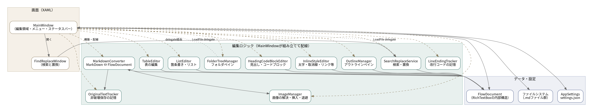
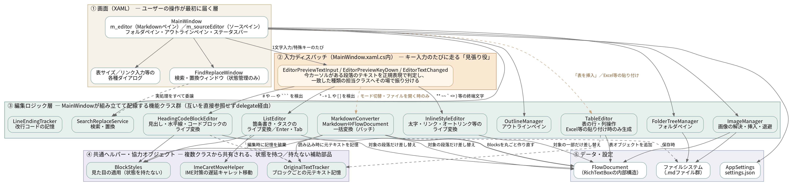
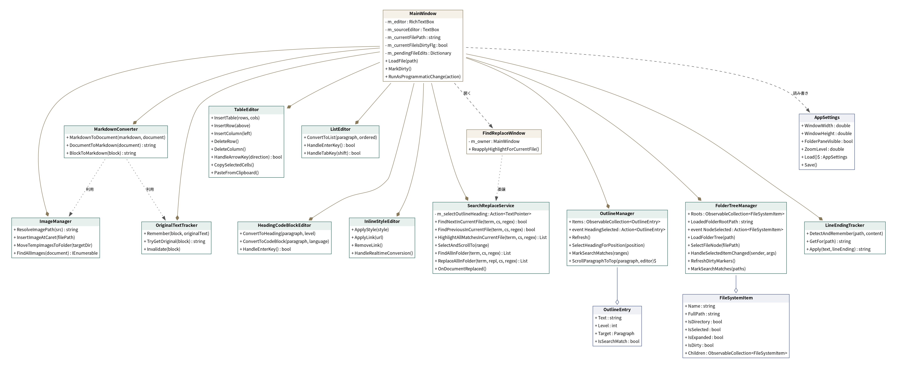
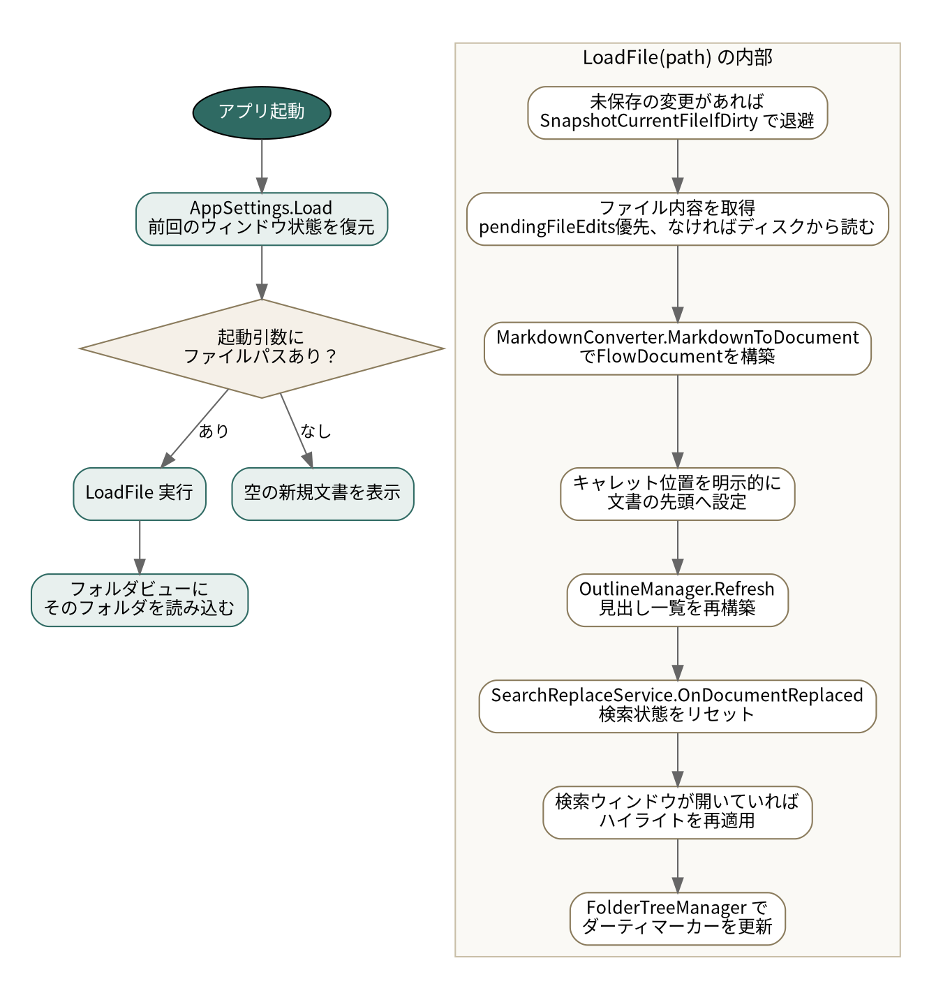
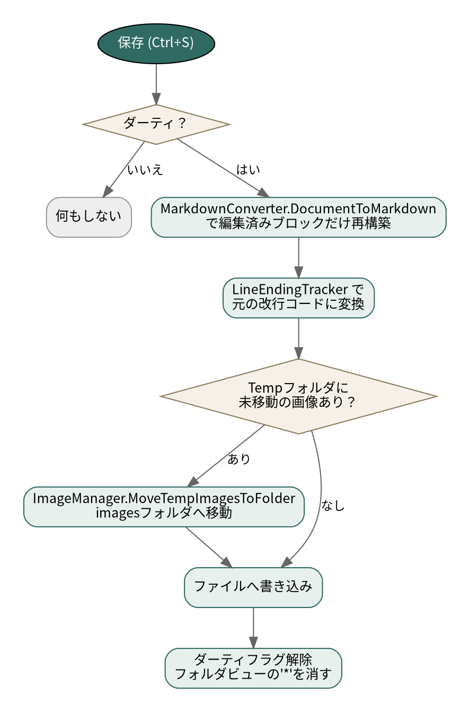
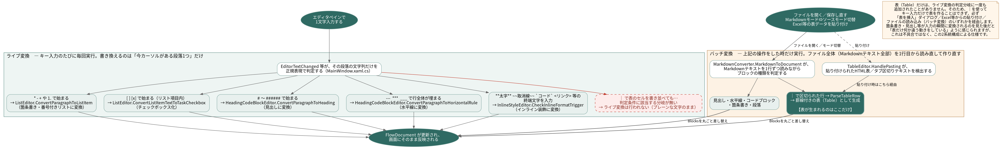
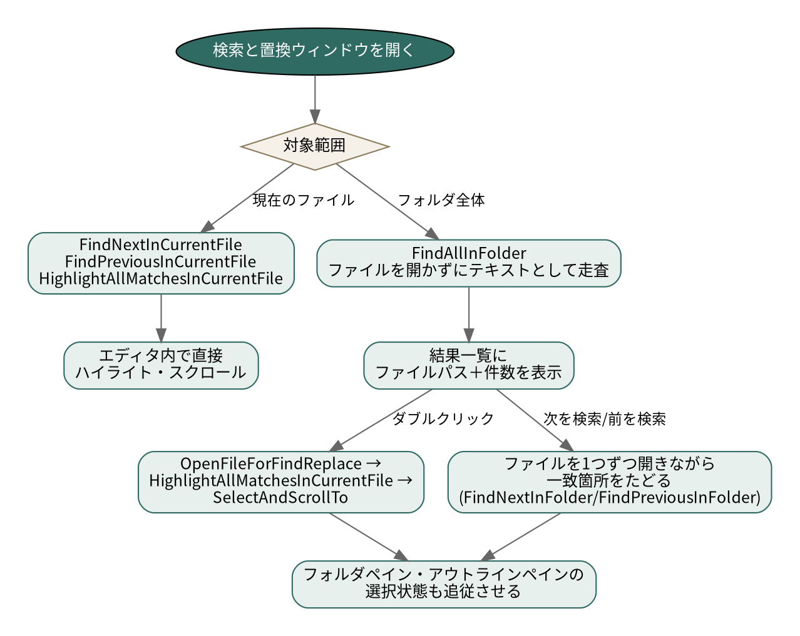
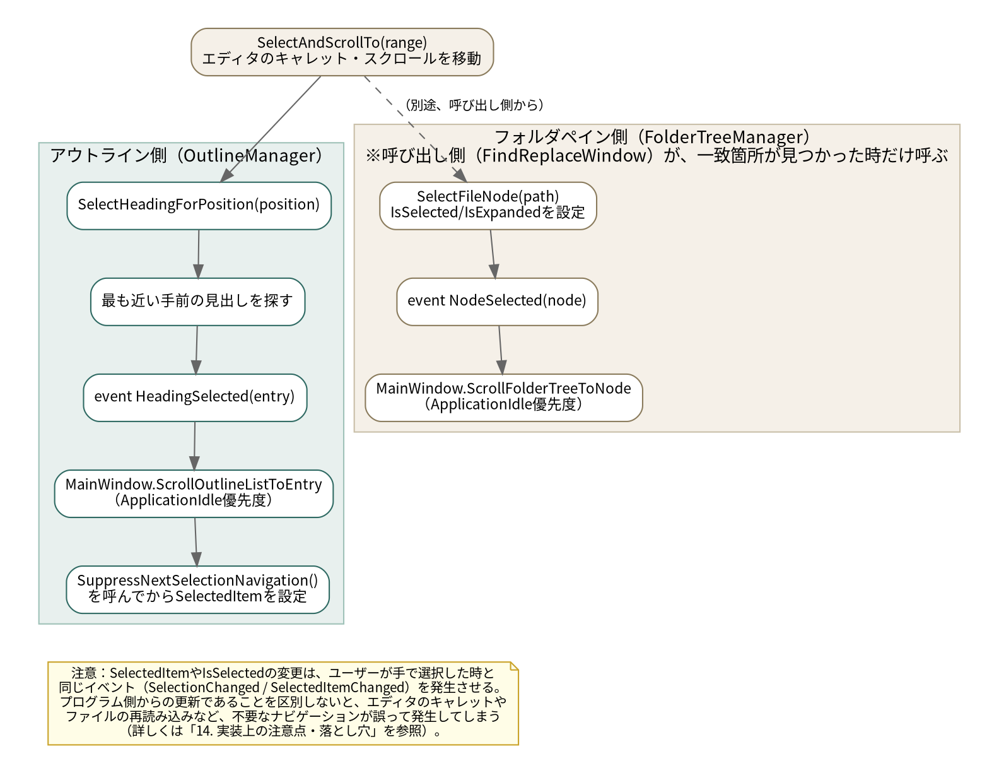

# mde 設計資料

このドキュメントは、mde（Markdown インラインエディタ）の内部構造をまとめた開発者向け資料です。
新しい機能を追加する時、既存の挙動を変更する時に、どのクラスが何を担当しているか、
どういう仕組みで動いているかを把握するために使ってください。

エンドユーザー向けの使い方は [`README.md`](../README.md) を参照してください。

## 目次

1. [概要](#1-概要)
2. [全体アーキテクチャ](#2-全体アーキテクチャ)
3. [クラス図](#3-クラス図)
4. [各クラスの責務](#4-各クラスの責務)
5. [データモデル](#5-データモデル)
6. [主要な処理フロー](#6-主要な処理フロー)
7. [ブロック単位の非破壊保存の仕組み](#7-ブロック単位の非破壊保存の仕組み)
8. [検索・置換の仕組み](#8-検索置換の仕組み)
9. [フォルダビュー・アウトラインビューの選択追従の仕組み](#9-フォルダビューアウトラインビューの選択追従の仕組み)
10. [画像の扱い](#10-画像の扱い)
11. [設定の保存](#11-設定の保存)
12. [コーディング規約](#12-コーディング規約)
13. [ビルド・配布](#13-ビルド配布)
14. [既知の制約](#14-既知の制約)

---

## 1. 概要

mde は、Markdown ファイルを WYSIWYG に近い形（プレビューと同じ見た目のまま）で直接編集できる
Windows デスクトップアプリです。編集用ペインとプレビュー用ペインを分離せず、`RichTextBox` の
`FlowDocument` を直接編集対象にすることで、「入力したそばから書式が反映される」体験を実現しています。

- **プラットフォーム**: .NET 8 / WPF（`net8.0-windows`）
- **配布形態**: フレームワーク依存の `.exe`（実行には .NET 8 Desktop Runtime が必要。
  同梱はしていない。ランタイムが無い環境で起動しようとすると、.NET自体の標準機能により
  自動的にインストール案内が表示される。詳細は13章・14章を参照）
- **対応フォーマット**: Markdown（`.md`）。表・画像・リンク・コードブロックを含む

## 2. 全体アーキテクチャ

mde は「MainWindow が全ての機能クラスを組み立てて delegate で配線する」構成です。各機能クラスは
基本的に他の機能クラスを直接参照せず、コンストラクタで渡された delegate 経由でのみ協調します。
これにより、各クラスは単体でテスト・理解しやすい単位に保たれています。



**設計方針として一貫していること**

- `TableEditor` / `ListEditor` / `HeadingCodeBlockEditor` / `InlineStyleEditor` / `ImageManager` /
  `SearchReplaceService` / `FolderTreeManager` は、いずれも `MainWindow` 本体への参照を持たず、
  必要な操作（ファイルを開く、ダーティ状態にする、等）はコンストラクタで渡された
  `Action` / `Func` delegate 経由で行います。これにより、`MainWindow.xaml.cs` を読まなくても
  各クラス単体の入出力（コンストラクタの引数）を見るだけで依存関係が分かります。
- `MarkdownConverter` は状態を持たず、`OriginalTextTracker` と `ImageManager` を協力オブジェクトと
  して受け取って変換を行います。
- `FindReplaceWindow` は別ウィンドウですが、実際の検索・置換処理は一切持たず、すべて
  `m_owner.SearchReplace`（`SearchReplaceService`）に委譲します。ウィンドウ自身は UI の状態と、
  フォルダ横断セッションでの「今どのファイル・どの一致箇所にいるか」だけを管理します。

### 2.1 レイヤー構成（階層図）

上の図はクラスを機能ごとにグループ分けしたものですが、「ユーザーの1回のキー入力が、実際に
どの部品をどの順番で通って画面に反映されるか」を、処理が伝わっていく順に上から下へ並べ
直したのが下の階層図です。



- **① 画面（XAML）**：`MainWindow` が持つ2つのエディタ（`m_editor`＝Markdownペイン、
  `m_sourceEditor`＝ソースペイン）や、フォルダ／アウトラインペインなど、ユーザーの操作が
  最初に届く層です。
- **② 入力ディスパッチ**：`MainWindow.xaml.cs` 内の `EditorPreviewTextInput` /
  `EditorPreviewKeyDown` / `EditorTextChanged` が、キー入力のたびに「今カーソルがある段落の
  文字列」を正規表現で判定し、該当する編集ロジック層のクラスへその場で振り分けます。実質的に
  「毎回のキー入力を見張って、担当クラスへ受け渡す交通整理役」です。この層の詳しい動きは、
  [6.4節「リアルタイム変換（ライブ入力変換）とバッチ変換の使い分け」](#64-リアルタイム変換ライブ入力変換とバッチ変換の使い分け)
  で扱います。
- **③ 編集ロジック層**：4章の表にある各機能クラス本体です。②から振り分けられた処理を
  実際に実行します。
- **④ 共通ヘルパー・協力オブジェクト**：`BlockStyles`（見た目の適用）・`OriginalTextTracker`
  （非破壊保存のための元テキスト記憶）・`ImeCaretMoveHelper`（IME対策の遅延キャレット移動）
  など、複数の編集ロジッククラスから共有される補助部品です。
- **⑤ データ・設定**：最終的にすべての操作が反映される `FlowDocument`（`RichTextBox` の
  内部構造）と、ファイルシステム・`AppSettings` です。

図中の実線は「その場で1つのブロックだけを書き換える」経路、破線は「ファイル全体の
再構築」や「別クラスへの処理委譲」を表す経路です（凡例は簡略化のため図中には明示して
いませんが、6.4節の図とあわせて同じ色分けの意味で使っています）。

## 3. クラス図



## 4. 各クラスの責務

| クラス | ファイル | 責務 |
|---|---|---|
| `MainWindow` | `MainWindow.xaml(.cs)` | メインウィンドウ。全機能クラスの構築・配線、現在のファイル状態、キー入力の振り分け |
| `MarkdownConverter` | `MarkdownConverter.cs` | Markdown テキスト ⇔ `FlowDocument` の相互変換 |
| `BlockStyles` | `BlockStyles.cs` | 見出し・コードブロックの見た目を適用する静的ヘルパー（状態を持たない） |
| `TableEditor` | `TableEditor.cs` | 表の行・列・表全体の削除を含む行・列操作、セル間移動、Excel 連携（TSV/HTML クリップボード） |
| `ListEditor` | `ListEditor.cs` | 箇条書き・順序付きリストの変換、Enter/Tab の挙動 |
| `HeadingCodeBlockEditor` | `HeadingCodeBlockEditor.cs` | 見出し・コードブロックへの変換、Enter/Tab の挙動 |
| `InlineStyleEditor` | `InlineStyleEditor.cs` | 太字・取消線・インラインコード・リンクの装飾、リアルタイム変換 |
| `ImageManager` | `ImageManager.cs` | 画像パスの解決、ドラッグ&ドロップ挿入・削除、一時フォルダ管理 |
| `SearchReplaceService` | `SearchReplaceService.cs` | 現在ファイル／フォルダ全体の検索・置換のすべてのロジック |
| `OutlineManager` | `OutlineManager.cs` | アウトラインペインの見出し収集・選択・スクロール |
| `FolderTreeManager` | `FolderTreeManager.cs` | フォルダペインのツリー構築・選択・未保存マーカー |
| `OriginalTextTracker` | `OriginalTextTracker.cs` | ブロック単位の非破壊保存のための「元テキスト」記憶 |
| `LineEndingTracker` | `LineEndingTracker.cs` | ファイルごとの改行コード（CRLF/LF）の検出・記憶 |
| `ImeCaretMoveHelper` | `ImeCaretMoveHelper.cs` | IME固まり対策（キー入力後のCaretPosition移動を遅延させる共通処理。状態を持たない静的クラス） |
| `DebugLogger` | `DebugLogger.cs` | IME固まり不具合調査用の簡易ファイルログ出力（`%LOCALAPPDATA%\mde\debug.log`）。状態を持たない静的クラス |
| `FindReplaceWindow` | `FindReplaceWindow.xaml(.cs)` | 検索と置換ウィンドウの UI 状態管理（処理自体は`SearchReplaceService`に委譲） |
| `AppSettings` | `AppSettings.cs` | ウィンドウ状態・ペイン幅・表示倍率の保存・復元（`settings.json`） |
| `Models.cs` の各クラス | `Models.cs` | `ImageInfo` / `HorizontalRuleInfo` / `AnchorInfo` / `CodeBlockInfo` / `LinkInfo` / `OutlineEntry` / `FileSystemItem` といった、状態を持つ小さなデータクラス群 |
| その他ダイアログ | `*Dialog.xaml(.cs)`, `AboutWindow.*` | 表サイズ指定、リンク入力、バージョン情報などの単純なモーダルダイアログ |

## 5. データモデル

編集内容は WPF の `FlowDocument`（`RichTextBox.Document`）としてメモリ上に保持されます。Markdown
特有の情報は、標準の `FlowDocument` 要素の `Tag` プロパティにメタデータを載せる形で表現しています。

| 要素 | `Tag` の内容 | 用途 |
|---|---|---|
| `Paragraph`（見出し） | `int`（1〜6） | 見出しレベル |
| `Paragraph`（コードブロック） | `CodeBlockInfo` | 言語名 |
| `Paragraph`（水平線） | `HorizontalRuleInfo` | 中身（Inlines）は空のまま、見た目は罫線で表現 |
| `Paragraph`（本文） | `null` | 通常の段落 |
| `Run`（装飾） | `"bold"` / `"strikethrough"` / `"underline"` / `"highlight"` / `"inline-code"` / `"escaped"` | インライン書式。`underline`は`TextDecorations.Underline`、`highlight`は`Background`（別途プロパティ）で表現し、`Tag`自体は判別用の印 |
| `Run`（リンク） | `LinkInfo` | リンク先URL、自動リンクかどうか |
| `Run`（アンカー） | `AnchorInfo` | `<a id="...">` の目印 |
| `Image` | `ImageInfo` | 元のsrc、alt、元の記法（html/md） |
| `CheckBox`（`InlineUIContainer`経由） | `"task-checkbox"` | タスクリストのチェックボックス（`BlockStyles.CreateTaskCheckbox`で生成） |

`FileSystemItem` と `OutlineEntry`（`Models.cs`）は `INotifyPropertyChanged` を実装しており、
フォルダペイン・アウトラインペインの表示（未保存マーカー、検索ヒットの強調表示、選択状態）を
データバインディングでライブに更新します。

## 6. 主要な処理フロー

### 6.1 起動〜ファイルを開く



### 6.2 保存



### 6.3 Markdown → FlowDocument 変換の概略


逆方向（`DocumentToMarkdown`）では、`OriginalTextTracker` に記憶されている「未編集」ブロックは
元テキストをそのまま使い、編集されたブロックだけを `FlowDocument` の現在の内容から Markdown へ
再構築します（詳細は[7章](#7-ブロック単位の非破壊保存の仕組み)）。

空行の判定（段落の区切り）は、単純な空白文字だけの行に加え、ゼロ幅スペース（U+200B）などの
見た目には空行にしか見えない書式文字のみで構成される行も空行として扱います
（`IsEffectivelyBlankLine`）。これは、`string.IsNullOrWhiteSpace` がこの種の文字を空白と
判定しないために起きうる、「見た目は空行なのに段落が区切られない」という不具合を防ぐための
ものです。

段落中の、空行を伴わない単純な改行（ソースの1行の終わり）をどう表示するかは、メニュー
「表示」→「段落中の改行」で選べます。「ソースの通りに改行する」（既定値。Typoraと同じ）では、
ソースの改行をそのまま見た目の改行（`LineBreak`）として表示します。「空行が入るまで改行しない」
（CommonMark・VSCodeのMarkdownプレビューと同じ）では、空行を伴わない改行は単なる空白として
扱われ、段落は画面幅で折り返して表示されるまで改行されません。実装上は、段落を組み立てる際に
連続するソース行を結合する箇所（`JoinParagraphSourceLines`）で、設定に応じて`\n`でつなぐか、
各行の前後の空白を落として半角スペース1つでつなぐかを切り替えているだけで、後段のインライン
解析（`AppendInlineMarkdownToParagraph`等）には手を入れていません。

### 6.4 リアルタイム変換（ライブ入力変換）とバッチ変換の使い分け

mde では「エディタペインに入力したそばから、書式（箇条書き・見出し・水平線・タスクリストの
チェックボックス・太字などのインライン装飾）がその場で反映される」体験を実現していますが、
これは**キー入力のたびに、今カーソルがある段落1つだけを直接書き換えている**からです
（下記「ライブ変換」）。一方、**表（`Table`）だけは、この仕組みの対象に一度も含まれたことが
ありません**。表は「表を挿入」ダイアログ・Excel等からの貼り付け・ファイル全体の読み込み
（＝2章の`MarkdownConverter.MarkdownToDocument`によるバッチ変換）のいずれかでしか生成されず、
`｜`でセルを書き並べても、キー入力だけで表に変わることはありません。



**ライブ変換**（図の左側・緑色）：`MainWindow.xaml.cs`の`EditorTextChanged`
（および特殊キー用の`EditorPreviewTextInput`/`EditorPreviewKeyDown`）が、キー入力の
たびに現在の段落の文字列だけを正規表現で判定し、一致した種類に応じて次のクラスへ
その場での書き換えを委譲します。

| 入力パターン | 呼び出し先 |
|---|---|
| `*` `-` `+` `1.` で始まる | `ListEditor.ConvertParagraphToListItem`（箇条書き・番号付きリストへ変換） |
| `[ ]` `[x]` で始まる（リスト項目内） | `ListEditor.ConvertListItemTextToTaskCheckbox`（チェックボックス化） |
| `#`〜`######` で始まる | `HeadingCodeBlockEditor.ConvertParagraphToHeading`（見出しへ変換） |
| `---`/`***`/`___` で行全体が埋まる | `HeadingCodeBlockEditor.ConvertParagraphToHorizontalRule`（水平線へ変換） |
| `**太字**` `~~取消線~~` `` `コード` `` `<リンク>` 等の終端文字 | `InlineStyleEditor.CheckInlineFormatTrigger`（インライン装飾へ変換） |
| `｜`で区切られたセル | **該当する分岐が無い（変換されない）** |

いずれも新しい`Paragraph`を作って既存の内容を移し替える、あるいは同じ`Paragraph`の
スタイルだけを変える形で実装されており、変換の影響範囲は常に「対象の段落1つ」にとどまります
（他の段落・ブロックは一切触りません）。ライブ入力中のフォーカス移動やキャレット操作は
IMEの予測変換候補と競合しやすいため（14.12節参照）、`ListEditor`のリスト変換では新しい
`Paragraph`オブジェクトを作って既存の内容を移す（生きたまま参照先を差し替えない）、
`ImeCaretMoveHelper`でキャレット移動を1ティック遅らせるといった対策を取っています。

**バッチ変換**（図の右側・橙色）：ファイルを開く・保存し直す・Markdownモードとソースモードを
切り替える・Excel等の表データを貼り付ける、といった操作をした時だけ実行され、`｜`で始まる行の
表を含め、ファイル（またはソースモードのテキスト全体）を1行目から読み直して`FlowDocument`の
`Blocks`を丸ごと作り直します。表がこの経路でしか生まれないのは、`ParseTableRow`によるパース
処理（`MarkdownConverter.MarkdownToDocument`）と、Excel等の貼り付けを検出する
`TableEditor.HandlePasting`の、どちらか一方でしか`Table`オブジェクトを構築していないためです。

**なぜこの構成になっているか**：かつて7.18相当の機能追加（`DEVELOPMENT_LOG.md`14.18節）で
バッチ変換側にしか対応を入れず、箇条書きの`+`・水平線・タスクリスト・メールアドレス自動
リンクの4機能が「ソースモードに切り替えて戻すまでライブ反映されない」という不具合として
表面化したことがあります（14.19節）。この時の修正で、上記4機能は個別にライブ変換側にも
実装が追加されましたが、**表の列揃え（`:---`/`---:`）を含む表そのものの生成は、ライブ変換側へ
移植されないまま現在に至っています**。これは見落としではなく、表という「行と列を持つブロック
全体」を1文字ごとに段階的に組み立てていく実装は、単一の段落を書き換えるだけの他のライブ変換
と比べて複雑さ・IME関連の不具合リスクが大きく増すため、意図的に見送られたものです（バッチ
変換・ダイアログ・貼り付けという確実な3経路が既にあることも理由の一つです）。将来この制約を
外す場合は、14.12節・14.20節で確立した「生きたまま`Paragraph`/`List`等を書き換えない」
「キャレット移動は遅延させる」という対策を、表という多段構造に対してどう適用するかから
検討する必要があります。

## 7. ブロック単位の非破壊保存の仕組み

見出し・段落・箇条書き・表・コードブロックといった **ブロック単位** で、「読み込んだ時の元テキスト」を
`OriginalTextTracker` が記憶します。保存時、そのブロックが編集されていなければ記憶した元テキストを
そのまま書き出し、編集されていれば `FlowDocument` の現在の内容から Markdown を再構築します。


**この仕組みが必要な理由**：Markdown には同じ見た目を表現する書き方が複数存在します
（例：箇条書きの `*` と `-`、番号付きリストの連番か `1.` の繰り返しか、表のセル内の余白の
入れ方など）。単純に「見た目から毎回 Markdown を機械的に生成する」実装にすると、触っていない
箇所の書き方までもが保存のたびに変わってしまい、Git 等での差分が意味のない場所にまで及んで
しまいます。ブロック単位で「変更したところだけ書き直す」ことで、この問題を避けています。

**トレードオフ**: ブロックとブロックの間の空行の数（段落の区切り方）は、編集の有無にかかわらず
1行の空行に統一されます。また、フォルダ全体を対象にした置換や「すべて置換」（現在のファイル
対象）は、ファイル全体を一度再構築する実装のため、そのタイミングで全ブロックが「編集済み」
扱いになります。

**右クリックメニューなど、キャレット位置とは無関係な箇所を書き換える操作の注意点**：
`EditorTextChanged`（`MainWindow.xaml.cs`）による自動的な「元テキスト」記憶の破棄は、その時点の
`m_editor.CaretPosition` が属するブロックに対して行われます。表の行・列・表全体の削除や画像の
削除のように、右クリックした位置（必ずしもキャレット位置と一致しない）のブロックを直接
書き換える操作では、この汎用処理には頼らず、実際に編集する対象の `TextPointer` を使って
`OriginalTextTracker.Invalidate(...)` を編集前に明示的に呼ぶ必要があります（`TableEditor.DeleteRow`
/`DeleteColumn`/`DeleteTable`、`ImageManager.DeleteImage` を参照）。

## 8. 検索・置換の仕組み

`SearchReplaceService` が唯一の検索・置換ロジックの実装です。`FindReplaceWindow` は状態管理と
UI 表示のみを担当し、実際の検索・置換はすべてこのクラスに委譲します。



**フォルダ全体の置換は保存されるまでファイルに書き出されない**：`SearchReplaceService` は
`pendingFileEdits`（`MainWindow` が保持する `Dictionary<string, string>`）にメモリ上でのみ
変更を保持します。「すべて保存」で、現在開いているファイルと保留中の変更があるすべての
ファイルをまとめて書き出します。

**検索と置換ウィンドウを開いたままファイルを切り替えた場合**：フォルダペインでファイルを
クリックすると `LoadFile` が呼ばれ、`OnDocumentReplaced()` で検索状態がリセットされます。この直後、
検索ウィンドウが開いていれば `FindReplaceWindow.ReapplyHighlightForCurrentFile()` を呼び、
現在の検索条件で新しく開いたファイルの一致箇所を再度ハイライトします。

## 9. フォルダビュー・アウトラインビューの選択追従の仕組み

検索結果へジャンプした時など、エディタ内の特定の位置へ移動したのに合わせて、フォルダビュー・
アウトラインビューの選択状態も追従させる仕組みです。



`ApplicationIdle` 優先度を使っている理由や、`SuppressNextSelectionNavigation()` が必要な理由など、
ここで過去に起きた不具合の詳細は `DEVELOPMENT_LOG.md` を参照してください。

## 10. 画像の扱い

```
画像をドラッグ&ドロップ
   → OSのTempフォルダへコピー（%TEMP%\mde\ウィンドウ固有ID\）
   → FlowDocumentにImage要素として挿入（ImageInfoに元情報を記録）
   → 保存する？
       いいえ → Tempのファイルは残るが実ファイルには一切影響なし
       はい   → ImageManager.RelocatePendingTempImages で
                ファイルと同じフォルダの「<ファイル名（拡張子除く）>.images」フォルダへ
                移動（なければ作成、同名衝突時は連番を付与）
```

画像の保存先フォルダ名は「ファイルごとに専用のフォルダ」（例：
`report.md` を保存すると `report.images\` フォルダへ）になっている。
同じフォルダに複数のMarkdownファイルを保存していても、各ファイルの画像が混ざらない。
なお、この変更は新しく一時フォルダから退避される画像だけに適用され、既存の`images`
フォルダを使って書かれた古いファイルはそのまま`images`フォルダを参照し続ける（自動的な
移行は行わない）。

ウィンドウを閉じるときに、そのウィンドウ専用の Temp サブフォルダは自動的に削除されます
（保存済みで既に移動済みのファイルは対象外）。複数ウィンドウを同時に開いていても、
ウィンドウごとに Temp のサブフォルダが分かれるため、無関係な画像ファイル名同士が衝突する
ことはありません。

画像パスの区切り文字は `/`・`\` のどちらでも解釈できます（Windowsの相対パスとして
`images\foo.png` のように書かれていても、`ImageManager` 側で `\` を `Path.DirectorySeparatorChar`
に変換してから解決します）。ただし、`` のパス部分に含まれる `\` は、
`MarkdownConverter.PreprocessEscapes` のエスケープ処理（`\*` のような記法の解釈）に
巻き込まれないよう、リンク文字列と同様にエスケープ処理の対象外にしています。

## 11. 設定の保存

`AppSettings` が `%AppData%\mde\settings.json` に、ウィンドウのサイズ・位置・最大化有無・
フォルダ/アウトラインペインの表示有無と幅・表示倍率・リンクの開き方・段落中の改行の扱いなどを
JSON 形式で保存します。起動時に `AppSettings.Load()` で読み込み、ウィンドウを閉じる時に保存
します。読み込みに失敗した場合（ファイルが存在しない、壊れている）は既定値を返します。

## 12. コーディング規約

このプロジェクトでは、以下の命名規則・記述スタイルを一貫して適用しています。新しいコードを
書く際もこれに従ってください。

| 対象 | 規則 | 例 |
|---|---|---|
| メンバー変数（フィールド） | `m_` プレフィックス | `m_currentFilePath` |
| メソッドの引数 | `a_` プレフィックス | `a_sender`, `a_path` |
| bool型の変数・プロパティ | `_flg` サフィックス | `m_isDirtyFlg`, `a_caseSensitiveFlg` |
| `ref`/`out`/`in` 引数 | `Rf` サフィックス | （該当箇所で使用） |
| enum 型 | `En` サフィックス | （該当箇所で使用） |
| ファイルエンコーディング | UTF-8 BOM + CRLF | 全ての `.cs` / `.xaml` |
| XMLドキュメントコメント | 日本語、簡潔に。「ベストエフォート」等の曖昧な言い回しは避ける | `/// <summary>...</summary>` |
| 判定式（`==`/`!=`） | 定数を左辺に置く（Yoda条件） | `null == x`、`0 == count` |
| `if`/`for`/`while`/`foreach` | 単文でも必ず `{}` で囲む | 省略しない |
| 1行の判定式 | 複数の比較演算子を1行に詰め込まず改行する | `&&`/`||` の前後で改行 |

これらの規約は、社内ツール `NamingFixer.Roslyn`（Roslyn を使った命名規則違反の自動検出・修正
ツール）で一括チェック・修正できます。

## 13. ビルド・配布

```
dotnet publish -c Release -r win-x64 --self-contained false
```

`bin\Release\net8.0-windows\win-x64\publish\` に `mde.exe` / `mde.dll` / `mde.runtimeconfig.json` /
`mde.deps.json` の4ファイルが生成されます（`msi\File.wxs` が実際にインストーラーへ含めている
ファイルもこの4つで、両者は一致しています）。これは**フレームワーク依存**の配布形態で、
実行には対象マシンに **.NET 8 Desktop Runtime** がインストールされている必要があります
（`mde.csproj` に `SelfContained`/`PublishSingleFile` 等の指定はなく、既定値のまま）。

.NET ランタイムはこのプロジェクトでは同梱していません（経緯は`DEVELOPMENT_LOG.md`を参照）。ランタイムが入っていないマシンで `mde.exe` を起動すると、
mde 自身のコードとは無関係に、.NET の apphost（`UseAppHost` の既定値が有効なため自動生成される
起動用exe）が「.NET をインストールしてください」という案内ダイアログを自動的に表示し、
適切なダウンロードページへ誘導します。これは .NET SDK の標準機能であり、mde 側に実装コードは
不要です。

開発時は Visual Studio 2022 以降で `mde.csproj` を開いて F5、またはコマンドラインで
`dotnet run`（.NET 8 SDK と「.NET デスクトップ開発」ワークロードが必要）。

## 14. 既知の制約

- ブロックとブロックの間の空行の数は、編集の有無にかかわらず1行の空行に統一されます。
- フォルダ全体を対象にした「すべて置換」・現在のファイル対象の「すべて置換」は、ファイル全体を
  一度再構築するため、そのタイミングで全ブロックが「編集済み」扱いになります。
- フォルダビューは既定で `.md` / `.markdown` ファイルのみ表示します。
- フォルダビューは `Microsoft.Win32.OpenFolderDialog`（.NET 8 で追加された API）を使用しています。
- 見出しへの変更を、箇条書き項目の中の段落に対して右クリックで行った場合、リストから完全に
  抜けずその場でスタイルだけ変わる簡易実装になっています。
- コードブロックの言語名を、作成後に変更する UI はありません（再作成が必要）。
- 水平線は、記号3個以上が間にスペース無しで並ぶ書き方（`---`/`***`/`___`）のみ対応です。
  `- - -` のようにスペースを挟む書き方には対応していません。
- リンク・画像のタイトル属性（`"title"`）は、既存のMarkdownに書かれていれば読み込み・
  保存できますが、mde上のUI（右クリックメニュー「リンクにする…」）から新規に付与する
  手段はまだありません。
- 水平線・タスクリストのチェックボックスへのライブ入力変換（入力中に即座にブロックへ
  変換される機能）は、キャレットが変換対象の段落にある間だけ働きます。他の段落を編集した
  直後にファイルを読み込み直したり、ソースモードとMarkdownモードを切り替えたりした場合は、
  代わりにバッチ変換（`MarkdownConverter.MarkdownToDocument`）が全体を再解釈するため、
  結果自体は変わりません。
- タスクリストの項目は、行頭に箇条書きマーカー（1段目「・」、2段目「○」、3段目以降「■」）と
  チェックボックスの両方が表示されます（Typora等と異なりマーカーだけを隠す表示にはしていない。
  マーカーを隠す対応はWPFの`List.MarkerStyle`がリスト単位でしか持てない制約により、Enterで
  新しい項目を作った際にリスト全体が壊れて見える副作用が実機で確認されたため撤回した）。
- PDF書き出しは、追加ライブラリを使わずWindows標準の「Microsoft Print to PDF」仮想プリンタへ
  印刷する方式のため（Chromiumに依存しないビルドを求められ、この方式に戻した。
  詳しい経緯は`DEVELOPMENT_LOG.md`参照）、いくつか制約があります。ソースモード中は書き出せず、
  Markdownモードへ切り替える必要があります。保存ダイアログに既定のファイル名を自動入力する
  ことはできず（Windows側の仕様上の制限）、代わりにファイル名をあらかじめクリップボードへ
  コピーしておくので、保存ダイアログでCtrl+Vにより貼り付けてください。書き出し後にPDFを
  自動で開く機能もありません。一方、インターネット接続やChromiumのダウンロードは一切不要です。
- mdeはフレームワーク依存の配布形態のため、実行には対象マシンに .NET 8 Desktop Runtime が
  必要です（同梱していません）。入っていないマシンで起動した場合、.NET自体の標準機能により
  「.NETをインストールしてください」という案内が自動的に表示されます（mde独自の実装ではなく、
  .NETのapphostが持つ既定の挙動です。13章参照）。
- このコードは Windows/WPF のビルド環境上で都度コンパイル検証されているわけではないため、
  大きな変更を加えた後は必ずビルドして確認してください。

